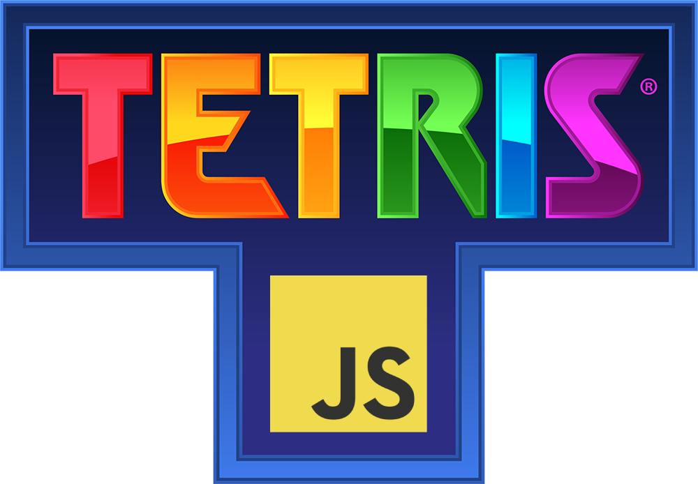

# 🎮 Tetris JS 🎮

  

This repository contains a simple Tetris game developed using JavaScript, HTML, and CSS. This project was created as an exercise for Module 1 of the Ironhack Web Development Bootcamp. The goal was to reinforce foundational skills in JavaScript by building an interactive game from scratch.

## 📑 Table of Contents

- [📖 Overview](#overview)
- [✨ Features](#features)
- [🎮 Controls](#controls)
- [🔗 Play the Game](#play-the-game)

## 📖 Overview

This version of Tetris replicates the classic block-stacking gameplay with a basic design. The game allows players to stack randomly shaped tetrominoes, aiming to clear lines and score points. The main focus of this project was to practice essential coding concepts such as:

- 📐 Manipulating the DOM
- 🖱️ Handling user input
- 🧩 Working with basic game logic
- ⏲️ Using timers for game loops

## ✨ Features

- 🎲 Basic gameplay with falling tetrominoes
- 🏆 Scoring and Ranking system
- 🧹 Line-clearing mechanic
- 🚫 Game over detection

## 🎮 Controls

- **⬅️ Arrow Left**: Move the tetromino left
- **➡️ Arrow Right**: Move the tetromino right
- **⬇️ Arrow Down**: Move the tetromino down faster
- **⬆️ Arrow Up**: Rotate the tetromino clockwise
- **Z**: Rotate the tetromino counter-clockwise
- **SPACE BAR**: Drop the tetromino to the bottom instantly
- **C**: Hold tetromino
- **ESC**: Pause the game

## 🔗 Play the Game

You can play the game by clicking on this link: [Play Tetris JS](https://darsay.github.io/tetris-js/)
